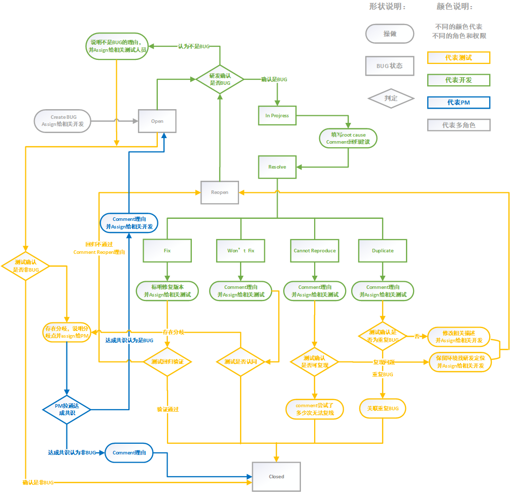

## 缺陷管理工具
Jira、ALM、Zentao、TestLink、Bugzilla、Mantis  

## 缺陷必要信息
> 【测试标题】  
[模块名称]XXX失败/异常/无响应/  
【测试环境】  
XXXXXXXXXXXX  
【测试步骤】  
XXXXXXXXXXXX  
【接口调用情况】 （非必要）
当有明显的接口异常时填写，包含如下内容：  
(1)请求URL  
(2)请求类型（GET/POST/PUT/DELETE）  
(3)请求参数  
(4)响应结果  
【预期结果】  
XXXXXXXXXXXX  
【实际结果】  
XXXXXXXXXXXX

备注：另外请注意填写时必要信息：项目、版本、模块、指派人、优先级等，不同的工具配置上略有差异

## 缺陷生命周期
