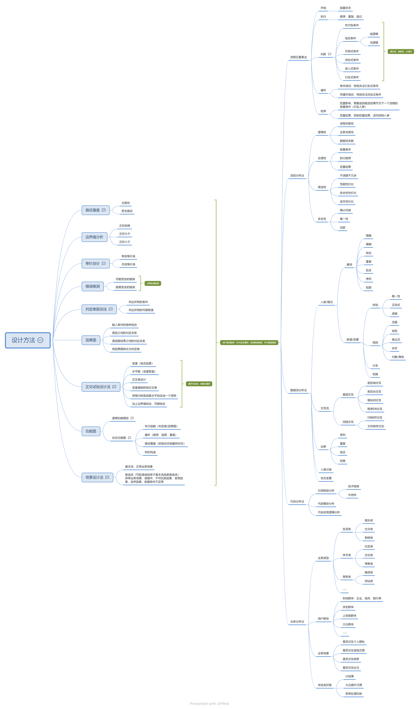

## 测试用例定义
> 是指对一项特定的软件产品进行测试任务的描述，体现测试方案、方法、技术和策略。其内容包括测试目标、测试环境、输入数据、测试步骤、预期结果、测试脚本等，最终形成文档。简单地认为，测试用例是为某个特殊目标而编制的一组测试输入、执行条件以及预期结果，用于核实是否满足某个特定软件需求。

### 测试用例基本要素
> 必要属性：用例标题、所属项目、优先级、用例类型、前置描述、测试步骤、预期结果  
> 扩展属性：所属版本、所属模块、评审状态、用例编号、后置条件、备注、测试目的、前置用例等

#### 功能测试用例
>针对具体功能点设计的功能用例，有具体的输入输出结果，比如：检验用户名长度最长限制/检验用户名长度最短限制/检验用户名长度为空限制

#### 冒烟功能用例
> 烟测功能试用例一般选取的是测试用例中优先级P0的用例，快速验证主功能可用

#### 主流程业务用例
> 根据业务设计的流程式用例，聚焦于某业务场景开始到结束，比如：普通业务员新增1路视频源，使用该视频源创建某任务，等待该任务产生告警，完成告警处理流程

#### 单接口用例
> 根据接口入参字段进行校验，必填字段输入，字段值判断为空/类型错误/长度超限制等

#### 接口业务流用例
> 根据业务设计的流程式用例，通过接口完成聚焦于某业务场景开始到结束

#### UI自动化用例
>一般根据主流程业务用例，通过UI完成聚焦于某业务场景开始到结束或进行前端展示元素校验

### 功能测试用例常见设计方法
1. 基于输入域的方法（等价类划分、边界值分析） 
2. 基于组合的方法（判定表、因果图、正交实验） 
3. 基于经验的方法（Ad-hoc、错误推测、缺陷模式）
4. 基于模型的方法（功能图、基于AI的模型遍历） 
5. 形式化的方法（形式化方法、形式化验证、有限状态机）

## 测试用例管理模式

### 管理模式
#### 版本式管理
测试用例数据在不同版本中是共享的，随着版本迭代用例的版本号属性不断加多，缺点是改动后会无法反映前面版本的用例内容导致老版本用例内容被覆盖。
#### 独立式管理
每个版本的测试用例都是独立的数据，随着版本迭代用例的数量会增加很多，缺点是每个版本启动新的用例设计时用例数会很多。

