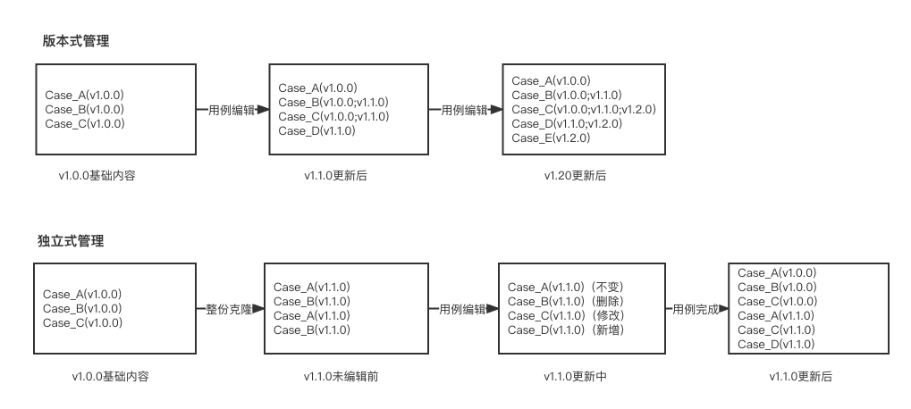

## 测试用例管理

### 管理模式
#### 版本式管理
测试用例数据在不同版本中是共享的，随着版本迭代用例的版本号属性不断加多，缺点是改动后会无法反映前面版本的用例内容导致老版本用例内容被覆盖。
#### 独立式管理
每个版本的测试用例都是独立的数据，随着版本迭代用例的数量会增加很多，缺点是每个版本启动新的用例设计时用例数会很多。

## 用例管理工具
1. 禅道
2. PingCode
3. TAPD
4. MeterSphere