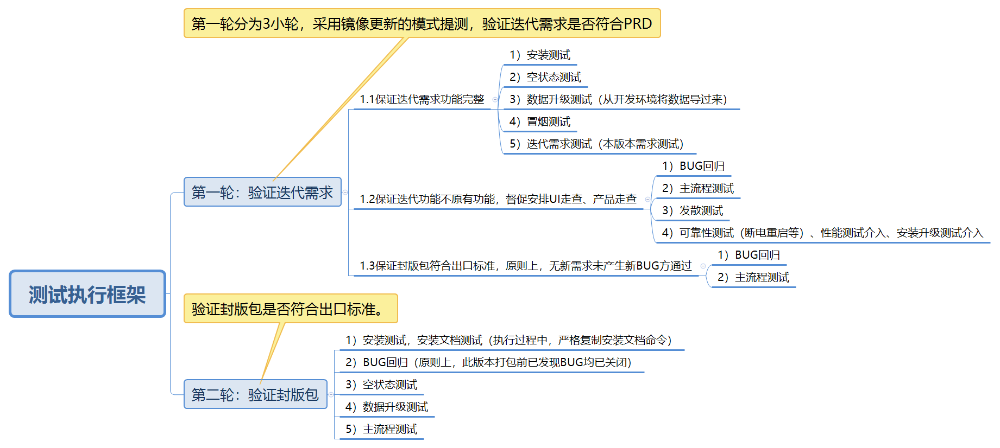

### 验证迭代需求
B位版本测试一般分为2轮，其中第一轮分为3小轮，采用镜像更新的模式提测，验证迭代需求是否符合PRD，第二轮验证封版包是否符合出口标准。

#### 保证迭代需求功能完整
1) 安装测试
2) 空状态测试
3) 数据升级测试（从开发环境将数据导过来)
4) 冒烟测试
5) 迭代需求测试（本版本需求测试)

#### 保证迭代功能不原有功能，安排UI走查、产品走查
1) BUG回归
2) 主流程测试
3) 发散测试
4) 可靠性测试（断电重启等)
5) 性能测试
6) 安装升级测试

#### 保证封版包符合出口标准，原则上，无新需求未产生新BUG方通过
1) BUG回归
2) 主流程测试

### 验证封版包
1) 安装测试
2) BUG回归
3) 空状态测试
4) 数据升级测试
5) 主流程测试

