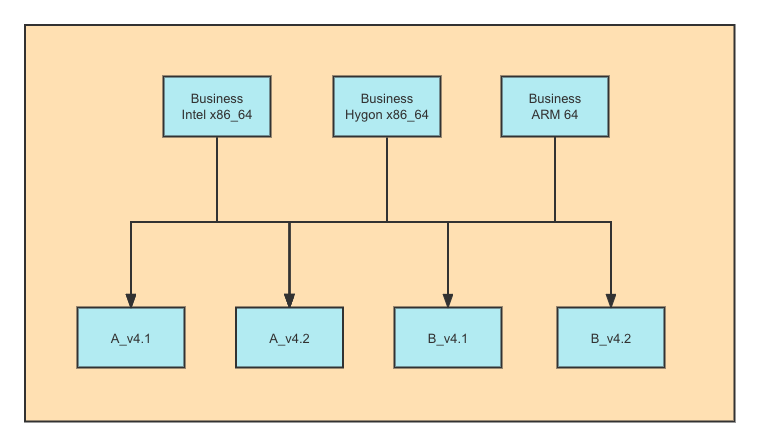
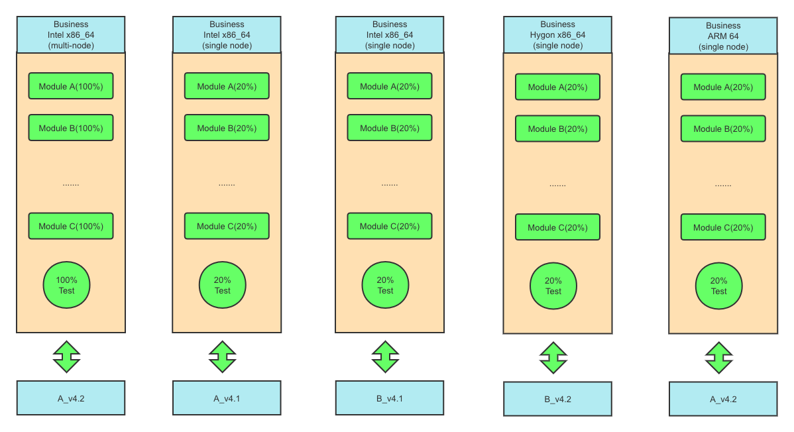

## 测试常见策略：
1. 全功能测试
2. 主流程测试
3. 主功能测试
4. 探索性测试
5. 自动化手段回归测试
6. 灰度测试

## Example
#### 以业务产品实际场景为例，我们梳理一下信息  
1. 2种部署方式（单节点+集群）
2. 3种硬件适配（Intel x86_64/Hygon x86_64/ARM 64）
3. 适配2种底层产品各2版本
4. 全功能测试用例7000+

### 估算功能测试工作量
1. 以单个测试环境组合（1业务+1底层）为基数， 得到基础功能测试工作环境最大系数为：2 * 3 * 2 * 2 = 24
2. 根据经验评估用例执行速度为100用例/人天，完整的功能测试用例执行完毕需要70人力（即7人投入需要10天）

#### 不考虑测试策略的情况下
在每种测试环境的组合下完整执行完所有功能测试用例，24组合*70人力=1680人力，成本非常巨大  

#### 考虑测试策略的情况下
> 方向1： 减少业务测试与底层适配的环境组合系数   
> 方向2： 通过梳理模块之间等价的用例，进行主功能测试减少工作量  
1. 确定是否所有适配硬件代码为同一套代码（一般情况下是），如果不是则业务层要根据需求适配所有部署方式+硬件组合
2. 梳理不涉及到到底层产品适配的纯业务模块，在主要适配环境进行全功能验证其他环境进行主功能验证
3. 梳理涉及到底层的业务系统模块，基于相同Viper版本号的底层接口保持一致，测试条件大致等价
4. 梳理底层如主算法及算法仓的切换，模块代码重构及接口变化程度，确保相应模块进行全功能测试或发散性测试
5. 梳理各模块优先级高的主功能用例及主流程用例

