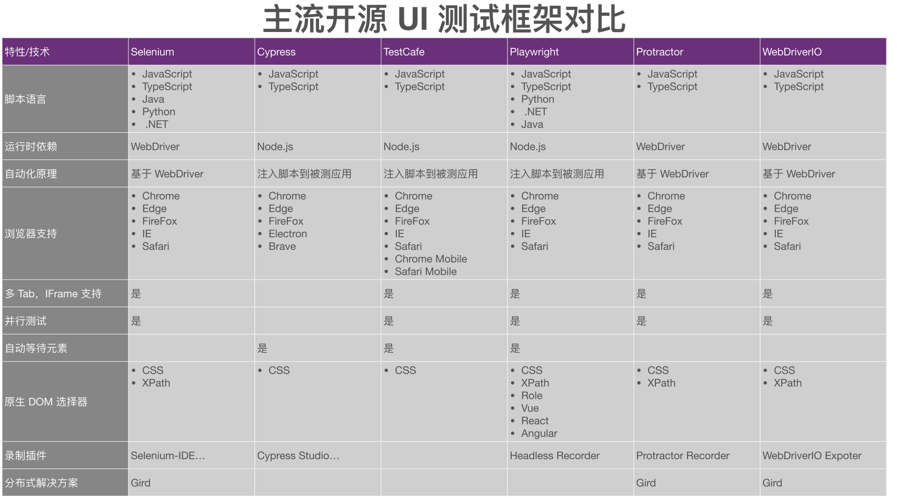
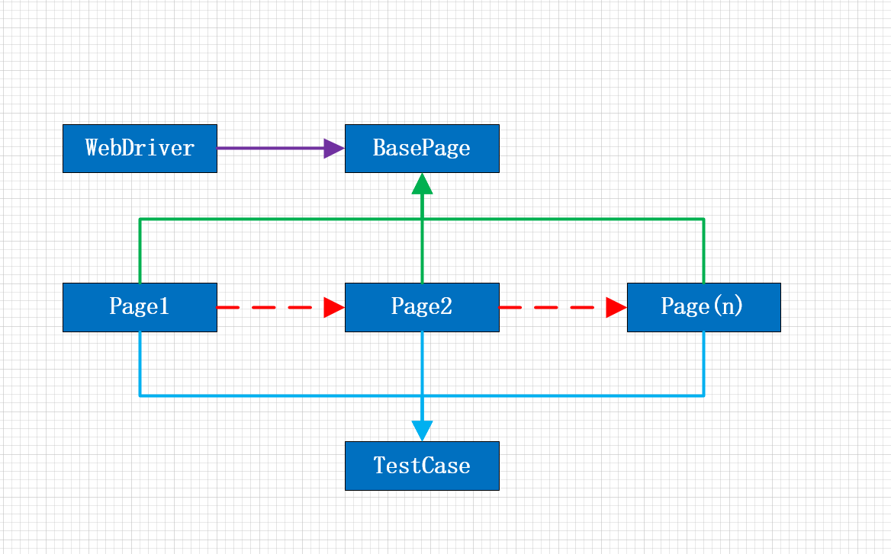

## Web UI Demo
> https://gitlab.sz.sensetime.com/scg-iva-bpl/business-best-practices/test/autotest_web_ui

## 什么是Selenium
Selenium 是一种开源工具，用于在 Web 浏览器上执行自动化测试（使用任何 Web 浏览器进行 Web 应用程序测试）。

## Selenium 与其他技术框架对比

相对于 Selenium 来说：
* Cypress 不支持并发测试，不支持多 Tab 页面，不支持 IFrame，这让我们放弃了对它的向往。
* TestCafe 不支持分布式的解決方案，而且我们没有找到合适的浏览器录制插件，基于时间考量，我们放弃了。
* Playwright 相对是比较符合我们的需求的，但是它没有现成分布式解决方案，基于时间考量，我们也放弃了。
* Protractor 和 WebDriverlO不用多说了，都是基于 WebDriver AP1 的再次封装。Protractor 直接被 Pass;
* WebDriverlo 只是增强了原版 Selenium 对于 Node.js下运行的支持，因而也被我们放弃。
总的来说，Selenium 在脚本语言、浏览器支持、并发、分布式以及插件录制视频录制方面都有完整的方案，并且与JMeter (webDriver Sampler) 有深度集成。从最广大用户群体的角度来说，从较为快速地搭建我们的自动化
测试平台的角度来说，从最为广泛的最佳实践角度来说，Selenium是 Web UI自动化的第一选择

## Selenium 技术架构
### IDE
一款浏览器录制插件。支持录制、回放、导出各种语言的脚本。
### GRID
Selenium 官方提供的批量执行测试用例的解决方案。
### WebDriver
通过封装浏览器 API 对外提供服务，使得不同语言 Selenium SDK 进行调用来 控制浏览器行为。

## Selenium 优缺点
### 优点
多浏览器、多语言支持、技术栈齐全，使用管饭，支持并发测试  
### 缺点
通过WebDriver中转操作浏览器存在一定的滞后性，容易因为资 源、网络的影响造成测试结果回放的不稳定，对现在SPA支持不如其他新生框架好。

## PO设计模式
> PO模式（Page Object）是自动化测试项目开发实践的最佳设计模式之一，将页面定位和业务操作分开，也就是把对象定位和测试脚本分开，从而提供可维护性。  
> 核心思想是通过对界面元素的封装减少冗余代码，主要体现在对界面交互细节的封装，也就是在实际测试中只关注业务流程。  
> 同时在后期维护中，若元素定位发生变化， 只需要调整页面元素封装的代码，提高测试用例的可维护性、可读性。  

## 容器化分布式执行客户端：Zelanium
由于Web UI自动化运行时间比较长，提高用例并发数量是最直接有效的手段，这里十分推荐Zelanium
> Zalenium 是一个Selenium Grid的扩展，它使用docker-selenium在本地运行基于Firefox和Chrome的测试.  
> 同样带有视频录制，实时预览，基础认证和仪表盘等功能；  
> 如果需要其他的浏览器，则需要用到云测试提供商（Sauce Labs，BrowserStack，TestingBot）提供的收费服务
> 在Zelanium是开源的，也可以在Kubernetes中使用。[Zaelnium Github](https://github.com/zalando/zalenium)
